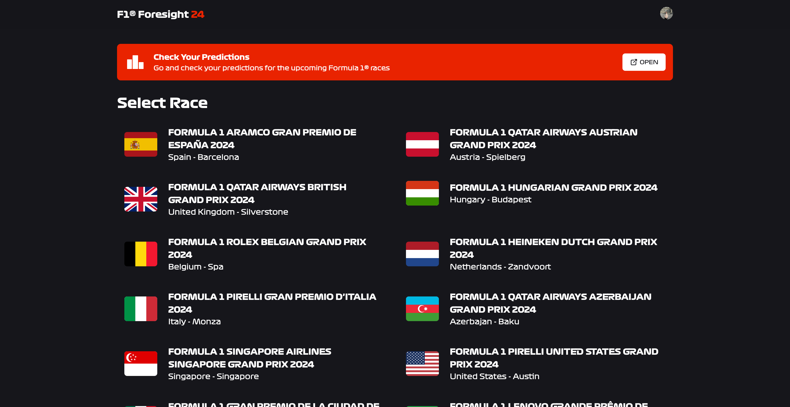
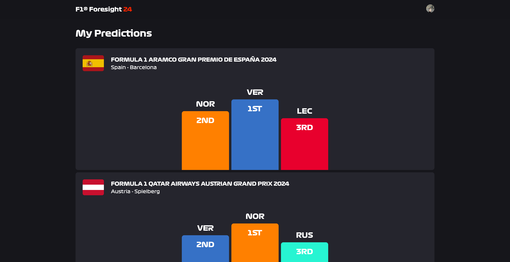
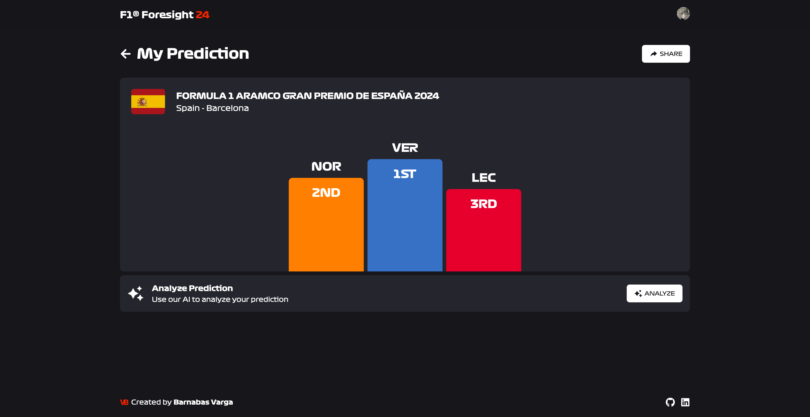

 

  

  <h3 align="center">F1 Foresight</h3>

  

    Can you predict the future?
     
    <a href="https://f1-foresight.vercel.app">View Demo</a>
  

## About The Project

I am a Formula 1 fan since early 2023 and always wanted to do a project around this amazing sport, and now it is done. F1 Foresight is a site where people can make predictions about the podiums of upcoming races. It also uses Gen AI to analyze these predictions and help the users make better predictions in the future.

Please note, F1 Foresight is not an official product of Formula 1 or Liberty Media and is in no way affiliated with the companies.

### Built With

Frontend:

- Next.js
- TailwindCSS

Backend:

- Hono
- Clerk
- ChatGPT
- PostgreSQL

## Usage

To get started, simply sign in. Then, pick a race and share your thoughts on who'll make it to the podium. After saving your prediction, you can view it on the predictions page and even share it with friends for a bit of competitive fun!
